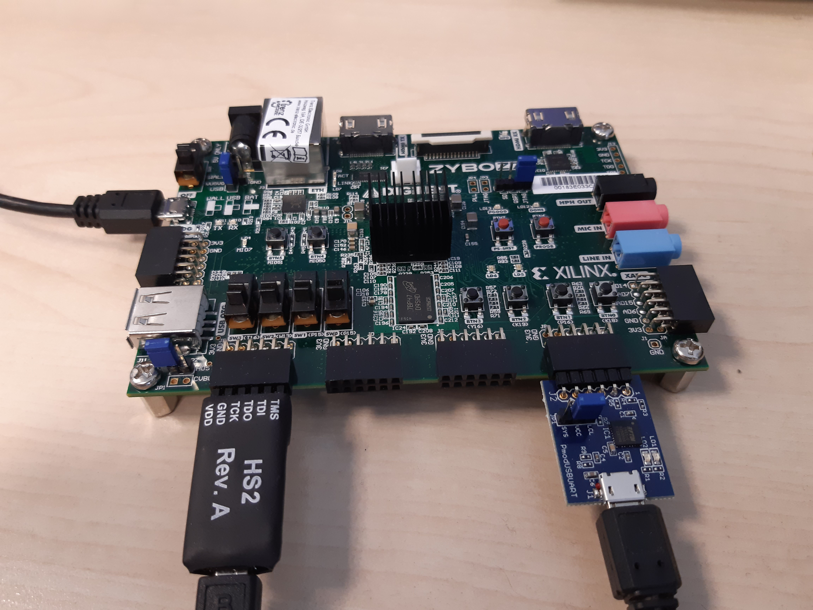
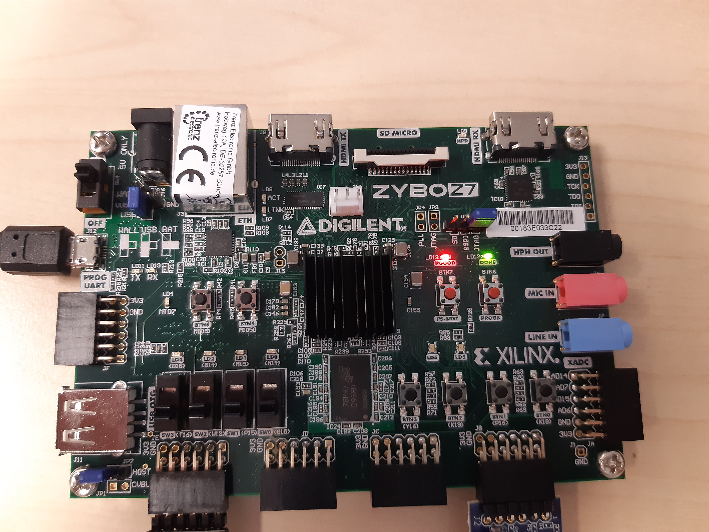
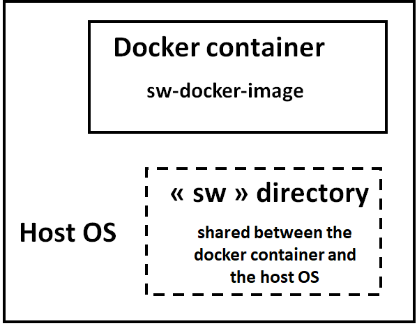

# Getting started

To get more familiar with CVA6 architecture, a partial documentation is available:

https://cva6.readthedocs.io/en/latest/

Checkout the repository and initialize all submodules:
```
$ git clone https://github.com/ThalesGroup/cva6-softcore-contest.git
$ git submodule update --init --recursive
```

Do not forget to check all the details of the contest in [Annonce RISC-V contest 2023-2024 v2.pdf](./Annonce%20RISC-V%20contest%202023-2024%20v2.pdf).

This repository contains the files needed for the 2021-2022 contest focusing on energy efficiency. The 2020-2021 contest focusing on the performance can be retrieved in this repository under the cv32a6_contest_2020 GitHub tag.

# Prerequisites


## Questa tool
Questa Prime **version 10.7** must be used to measure power during the simulations.
Other simulation tools and versions will receive no support from the organization team.

## Vitis/Vivado setting up
For the contest, the CVA6 processor will be implemented on Zybo Z7-20 board from Digilent. This board integrates a Zynq 7000 FPGA from Xilinx. 
To do so, **Vitis 2020.1** environment from Xilinx needs to be installed.

Furthermore, Digilent provides board files for each development board.

These files ease the creation of new projects with automated configuration of several complicated components such as Zynq Processing System and memory interfaces.

All guidelines to install **vitis 2020.1** and **Zybo Z7-20** board files are explained in
https://reference.digilentinc.com/reference/programmable-logic/guides/installation.

**Be careful about your linux distribution and the supported version of Vitis 2020.1 environment.**


## Hardware 
If you have not yet done so, start provisioning the following:

| Reference	                 | URL                                                                             |	List price |	Remark                            |
| :------------------------- | :------------------------------------------------------------------------------ | ---------: | :-------------------------------- |
| Zybo Z7-20	                | https://store.digilentinc.com/zybo-z7-zynq-7000-arm-fpga-soc-development-board/ |    $299.00	| Zybo Z7-10 is too small for CVA6. |
| Pmod USBUART               |	https://store.digilentinc.com/pmod-usbuart-usb-to-uart-interface/               |      $9.99 |	Used for the console output       |
| JTAG-HS2 Programming Cable |	https://store.digilentinc.com/jtag-hs2-programming-cable/                       |     $59.00	|                                   |
| Connectors                 |	https://store.digilentinc.com/pmod-cable-kit-2x6-pin-and-2x6-pin-to-dual-6-pin-pmod-splitter-cable/ | $5.99 |	At least a 6-pin connector Pmod is necessary; other references may offer it. |


# FPGA platform

A FPGA platform running **CV32A6** (CVA6 in 32b flavor) has been implemented on **Zybo Z7-20**

This platform includes a CV32A6 processor, a JTAG interface to run and debug software applications and a UART interface to display strings on hyperterminal.

The steps to run the RIPE application on CV32A6 FPGA platform are described below.

The JTAG-HS2 programming cable is initially a cable that allows programming of Xilinx FPGAs (bitstream loading) from a host PC.

In our case, we use this cable to program software applications on the CV32A6 instantiated in the FPGA through a PMOD connector.

## Get the Zybo ready

1. First, make sure the Digilent **JTAG-HS2 debug adapter** is properly connected to the **PMOD JE** connector and that the USBAUART adapter is properly connected to the **PMOD JB** connector of the Zybo Z7-20 board.


2. Generate the bitstream of the FPGA platform:
```
$ make cva6_fpga
```

3. When the bitstream is generated, switch on Zybo board and run:
```
$ make program_cva6_fpga
```
When the bitstream is loaded, the green LED `done` lights up.


4. Get a hyperterminal configured on /dev/ttyUSB0 115200-8-N-1

Now, the hardware is ready and the hyperterminal is connected to the UART output of the FPGA. We can now start the software.

## Get started with software environment

### Building the docker image

Install Docker on the workstation.

A **sw-docker** docker container is used to ease the installation of RISC-V tools including the toolchain and OpenOCD.

1. The **sw-docker** image can be built using the following command:

```
docker build -f Dockerfile --build-arg UID=$(id -u) --build-arg GID=$(id -g) -t sw-docker:v1 .
```

### Using the docker image

the **sw-docker** Docker container consists of the entire RISC-V compilation chain as well as the openocd tool.

2. To compile software applications in **sw/app**, you need to use Docker container with the following command:

```
docker run -ti --privileged -v `realpath sw`:/workdir sw-docker:v1
```

The **sw** directory is mounted in the docker container.


Once in the **sw-docker** Docker container, you are in the default directory **/workdir** which corresponds to the sw directory in the host OS.

```
user@[CONTAINER ID]:/workdir$ ll
total 24
drwxrwxr-x  5 user user 4096 Nov 23 10:57 ./
drwxr-xr-x  1 root root 4096 Nov 24 09:09 ../
-rw-rw-r--  1 user user 2620 Nov 23 10:57 README.md
drwxrwxr-x 18 user user 4096 Nov 23 10:59 app/
drwxrwxr-x  5 user user 4096 Nov 23 10:57 bsp/
drwxrwxr-x  2 user user 4096 Nov 23 10:57 utils/
```

3. To compile mnist application, run the following commands.
```
user@[CONTAINER ID]:/workdir$ cd app
user@[CONTAINER ID]:/workdir/app$ make mnist

```
At the end of the compilation the mnist.riscv executable file must be created.

4. Then, in the Docker container, launch **OpenOCD** in background:
```
user@[CONTAINER ID]:/workdir/app$ openocd -f openocd_digilent_hs2.cfg &
[1] 90
user@[CONTAINER ID]:/workdir/app$ Open On-Chip Debugger 0.11.0-dirty (2023-11-23-09:23)
Licensed under GNU GPL v2
For bug reports, read
    http://openocd.org/doc/doxygen/bugs.html
DEPRECATED! use 'adapter driver' not 'interface'
DEPRECATED! use 'adapter speed' not 'adapter_khz'
Info : auto-selecting first available session transport "jtag". To override use 'transport select <transport>'.
Info : clock speed 1000 kHz
Info : JTAG tap: riscv.cpu tap/device found: 0x249511c3 (mfg: 0x0e1 (Wintec Industries), part: 0x4951, ver: 0x2)
Info : datacount=2 progbufsize=8
Info : Examined RISC-V core; found 1 harts
Info :  hart 0: XLEN=32, misa=0x40141101
Info : starting gdb server for riscv.cpu on 3333
Info : Listening on port 3333 for gdb connections
Ready for Remote Connections
Info : Listening on port 6666 for tcl connections
Info : Listening on port 4444 for telnet connections
```

5. In the Docker container (same terminal), launch **gdb** as following:
```
user@[CONTAINER ID]:/workdir/app$ riscv-none-elf-gdb mnist.riscv
GNU gdb (GDB) 14.0.50.20230114-git
Copyright (C) 2022 Free Software Foundation, Inc.
License GPLv3+: GNU GPL version 3 or later <http://gnu.org/licenses/gpl.html>
This is free software: you are free to change and redistribute it.
There is NO WARRANTY, to the extent permitted by law.
Type "show copying" and "show warranty" for details.
This GDB was configured as "--host=x86_64-pc-linux-gnu --target=riscv-none-elf".
Type "show configuration" for configuration details.
For bug reporting instructions, please see:
<https://www.gnu.org/software/gdb/bugs/>.
Find the GDB manual and other documentation resources online at:
    <http://www.gnu.org/software/gdb/documentation/>.

For help, type "help".
Type "apropos word" to search for commands related to "word"...
Reading symbols from mnist.riscv...
(gdb)
```

6. In **gdb**, you need to connect gdb to **openocd** as following:
```
(gdb) target remote :3333
Remote debugging using :3333
Info : accepting 'gdb' connection on tcp/3333
Warn : Prefer GDB command "target extended-remote 3333" instead of "target remote 3333"
0x00010ec4 in ?? ()
(gdb)
```

7. In **gdb**, load **mnist.riscv** to CV32A6 FPGA platform by the load command:
```
(gdb) load
Loading section .vectors, size 0x80 lma 0x80000000
Loading section .init, size 0x60 lma 0x80000080
Loading section .text, size 0xe518 lma 0x800000e0
Loading section .rodata, size 0x11c2c lma 0x8000e5f8
Loading section .eh_frame, size 0x3c lma 0x80020224
Loading section .data, size 0x91c lma 0x80020260
Loading section .sdata, size 0x60 lma 0x80020b80
Start address 0x80000080, load size 134108
Transfer rate: 57 KB/sec, 9579 bytes/write.
(gdb) 
```

8. At last, in gdb, you can run the **mnist** application by command **c**:
```
(gdb) c
Continuing.
(gdb) 
```

9. On the hyperterminal configured on /dev/ttyUSB0 11520-8-N-1, you should see:
```
Expected  = 4
Predicted = 4
Result : 1/1
credence: 82
image env0003: 1731593 instructions
image env0003: 2353693 cycles
```

This result is obtained just after the FPGA bitstream loading.
When MNIST is rerun system is not at initial state. For instance, cache is preloaded.


# Simulation get started
When the development environment is set up, it is now possible to run a simulation.
Some software applications are available into the **sw/app** directory. Especially, there are benchmark applications such as Dhrystone and CoreMark and other test applications.

To simulate a software application on CVA6 processor, run the following command:
```
$ make sim APP=’application to run’
```
For instance, if you want to run the **mnist** application, you will have to run :
```
$ make sim APP=mnist
```

**This command:**
- Compiles CVA6 architecture and testbench with Questa Sim tool.
- Compiles the software application to be run on CVA6 with RISCV tool chain.
- Runs the simulation.

Questa tool will open with waveform window. Some signals will be displayed; you are free to add as many signals as you want.

Moreover, all `printf` used in software application will be displayed into the **transcript** window of Questa Sim and save into **uart** file to the root directory.

> Simulation may take lot of time, so you need to be patient to have results.

Simulation is programmed to run 10000000 cycles but the result is displayed before the end of simulation.

For **mnist** application, at the end of the simulation, result is diplayed as following:
```
Expected  = 4
Predicted = 4
Result : 1/1
credence: 82
image env0003: 1731593 instructions
image env0003: 2316653 cycles
```

CVA6 software environment is detailed into `sw/app` directory.

# Synthesis and place and route get started
You can perform synthesis and place and route of the CVA6 architecture.

In the first time, synthesis and place and route are carried in "out of context" mode, that means that the CVA6 architecture is synthetized in the FPGA fabric without consideration of the external IOs constraints.

That allows to have an estimation of the logical resources used by the CVA6 in the FPGA fabric as well as the maximal frequency of CVA6 architecture. They are both major metrics for a computation architecture.

Command to run synthesis and place & route in "out of context" mode:
```
$ make cva6_ooc CLK_PERIOD_NS=<period of the architecture in ns>
```
For example, if you want to clock the architecture to 50 MHz, you have to run:
```
$ make cva6_ooc CLK_PERIOD_NS=20
```
By default, synthesis is performed in batch mode, however it is possible to run this command using Vivado GUI:
```
$ make cva6_ooc CLK_PERIOD_NS=20 BATCH_MODE=0
```
This command generates synthesis and place and route reports in **fpga/reports_cva6_ooc_synth** and **fpga/reports_cva6_ooc_impl**.


